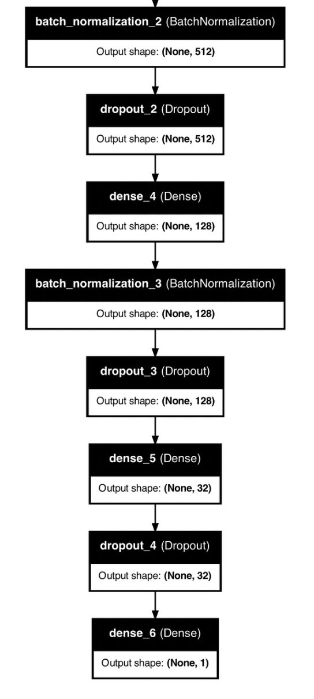

# Predicting Customer Satisfaction with the Santander Dataset

This project focuses on predicting whether a Santander customer is satisfied (1) or not (0). The dataset is both **imbalanced** and **high-dimensional**, with **400,000** rows and **202** features. To tackle these challenges, we applied several data preparation techniques, evaluated linearity, addressed class imbalance, and trained a deep learning model to achieve high predictive accuracy.

---

## Overview

Due to the **large dimensionality (202 features)** and **complex, uninformative feature names**, straightforward inspection of the dataset is not feasible. The numeric columns provide little immediate insight, making advanced data manipulation and exploration techniques necessary.

---

## Key Steps

### 1. Assessing Linearity
We developed a function called `assess_linearity` to determine if the dataset’s relationships are predominantly linear or non-linear. This step was crucial, given the dataset’s high dimensionality and potential for complex interactions.

---

### 2. Addressing Class Imbalance with SMOTE
The target variable was significantly imbalanced (approximately **179,902** samples labeled 0 vs. **20,098** labeled 1). To mitigate this, we used **SMOTE** (Synthetic Minority Oversampling Technique) to generate new samples for the minority class, resulting in a more balanced training set.

- **Before SMOTE**  
    
  

- **After SMOTE**  
  

---

### 3. QuantileTransformer for Scaling
We chose **QuantileTransformer** with `output_distribution='normal'` instead of a standard scaler. 

**Why is QuantileTransformer better in this case?**  
- **Robust to outliers**: By mapping data to a uniform or normal distribution, it reduces the influence of extreme values.  
- **Works well with skewed data**: Quantile-based scaling preserves the overall shape of the distribution while normalizing it.  
- **Improved performance in non-linear models**: Non-linear transformations can help certain algorithms (like neural networks) learn more effectively.

## 4. Deep Learning Model
A deep learning architecture was implemented to handle the high-dimensional feature space. Below are snapshots of the model’s structure and the training progression:

### Model Architecture

---

### Initial Epochs
The model converged relatively quickly:

---

### Final Epochs
By the end of training, the model achieved nearly **95% accuracy**:

---

## 5. Prediction Results
After data preprocessing, balancing, and scaling, our deep learning model demonstrated strong predictive performance on the test set. These results highlight the effectiveness of the chosen techniques.

---

## Conclusion
In this project, I tackled a **high-dimensional, imbalanced** dataset by:

- Evaluating linear vs. non-linear relationships  
- Applying SMOTE for class balancing  
- Using Quantile Transformation for scaling  
- Training a deep neural network  

These steps allowed us to extract meaningful insights and achieve an accuracy of nearly **92%*
