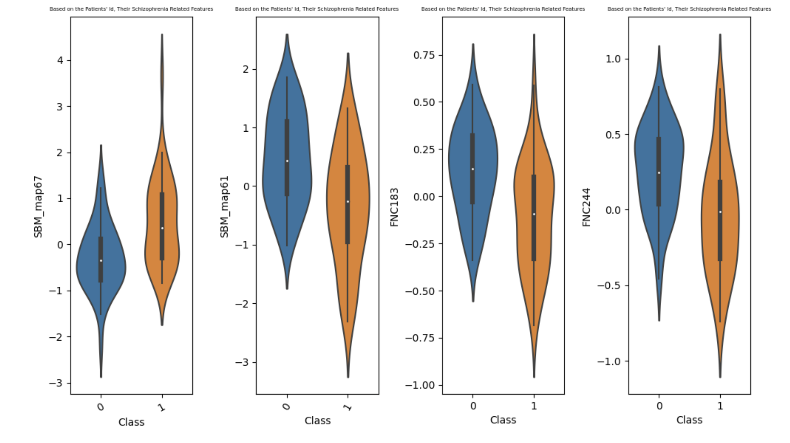
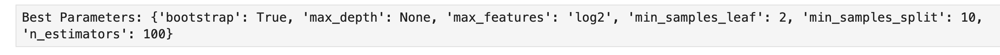

# Predicting Schizophrenia Based on FNC and SBM Values

This project focuses on predicting whether a patient has Schizophrenia (binary classification) using a dataset that includes **Functional Network Connectivity (FNC)** and **Source-Based Morphometry (SBM)** features. The dataset is **high-dimensional**, containing **86 rows** and **412 features**, which necessitated careful data preparation, correlation analysis, and hyperparameter tuning to achieve a robust predictive model.

---

## Overview

Due to the **large number of features (412)** and **limited sample size (86)**, the data is both challenging to interpret and prone to overfitting. Feature names are not inherently descriptive, and straightforward inspection is difficult. Therefore, we employed advanced data manipulation, visualization, and model selection techniques to uncover meaningful patterns and build a reliable classifier.

---

## Key Steps

### 1. Identifying Highly Correlated Features
- **Pearson Correlation**: We computed correlation coefficients to find features that were highly linearly correlated. Reducing redundant features helps mitigate multicollinearity.
- **Outlier Inspection**: Although we searched for outliers, none were found that warranted removal.

---

### 2. Data Visualization
- **Matplotlib & Seaborn**: We created various plots (e.g., histograms, pair plots, correlation heatmaps) using `plt.subplots()` and Seaborn functions.
- **Insights**: These visualizations provided a clearer picture of feature distributions and relationships within the data.

---

### 3. Grid Search for Model Tuning
- **Model Selection**: We experimented with multiple classification algorithms (e.g., Logistic Regression, SVM, Random Forest). Random Forest gave the most promising initial results.
- **Hyperparameter Optimization**: We used Grid Search to fine-tune parameters such as `n_estimators`, `max_depth`, and more.
  
  

---

### 4. Results
- **Final Model**: After applying the optimized hyperparameters to the entire dataset, our Random Forest model achieved an accuracy of **~80%** on the private leaderboard of Kaggle.
- **Significance**: This performance is notable given the high dimensionality and relatively small sample size.

---

## Conclusion

By combining **correlation-based feature filtering**, **comprehensive data visualization**, and a **hyperparameter-tuned Random Forest**, we effectively tackled a complex, high-dimensional dataset to predict Schizophrenia with solid accuracy. 

**Potential Next Steps**  
- **Further Dimensionality Reduction**: Techniques like PCA or autoencoders may uncover more compact representations.  
- **Advanced Models**: Exploring gradient boosting or deep learning architectures could improve performance further.  
- **Data Expansion**: Collecting additional samples or leveraging domain knowledge may help refine model accuracy and interpretability.
